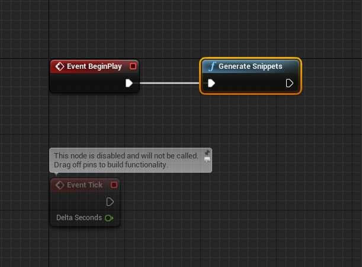

# LuaSnippetsPlugin
Generate Lua Snippets for UE4.

## Feature
- Auto Generate Snippets
- Regular match
    - eg. Type "setactor", you will get all results that contain it, such as "SetActorRotation"
- Fuzzy match
    - eg. Type "Actor_", you will get all results about Actor.
- Jump to next params quickly in function snippets.

## Support Editor
- Visual Studio Code
- Atom

## Generate Snippets
### C++
```
#include "GenerateSnippetsHelper.h"

void FLuaSnippetsPluginModule::StartupModule()
{
	// This code will execute after your module is loaded into memory; the exact timing is specified in the .uplugin file per-module
    UGenerateSnippetsHelper::GenerateSnippets();
}
```

### Blueprint


## Snippets Saved Floder
- Visual Studio Code : `$Home/.vscode/extensions/ue4-snippets-lua/`
- Atom : `$Home/.atom/packages/ue4-snippets-lua/`
